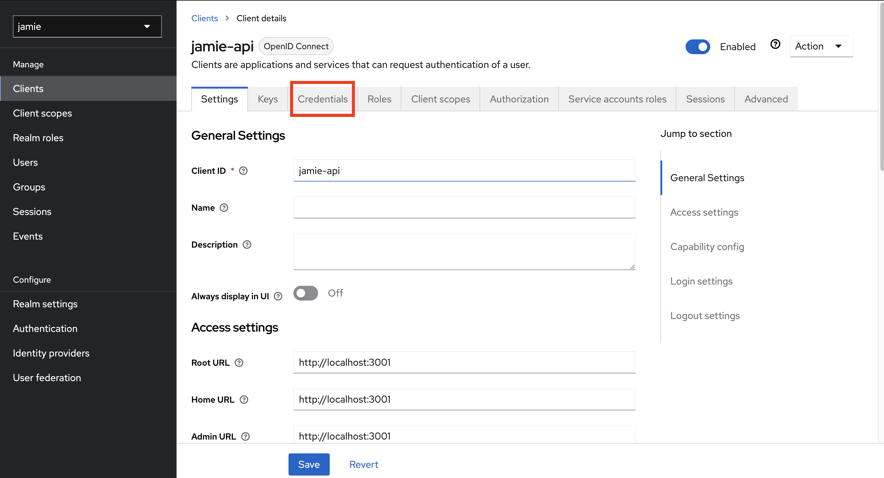

# Jamie API

## Descrição

Este projeto é desenvolvido com o framework [Nest](https://github.com/nestjs/nest) framework.

## Dependências

Para executar o projeto Jamie API em sua máquina, é necessário configurar algumas dependências. Certifique-se de que você possui os seguintes pré-requisitos:

- [Node](https://nodejs.org/en)
- [npm](https://www.npmjs.com/)
- [yarn](https://yarnpkg.com/)
- [Docker](https://www.docker.com/)

## Instalação

Abra o terminal no projeto jamie api e digite:

```bash
 yarn
```

Em seguida, rode o comando do Docker: 

```bash
 docker compose up -d
```
### Configuração de Ambiente

Em seguida faça uma cópia do arquivo `.env.development`, deixando ele apenas ficar com o nome de `.env`. Será necessário configure a variável `KEYCLOAK_SECRET` para isso é necessário que você baixe o [jamie-ui](https://github.com/bancodobrasil/jamie-ui) e faça os passos do README. 

Em seguida, após fazer toda a configuração do KeyCloak, basta mudar o **Realm** para o `jamie` e clique no menu lateral de **Clients**. Em seguida, na coluna de **Client ID** clique em `jamie-api`, abrirá uma tela semelhante a seguir:



  Clique em **Credentils**, lá terá uma chave em **Client secret**. Em seguida, cópie-o e coloque na variável `KEYCLOAK_SECRET`.

```bash
  KEYCLOAK_SECRET=Secret
```